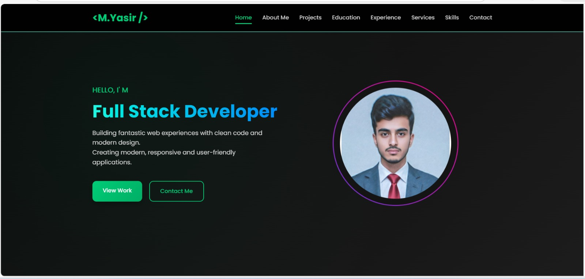
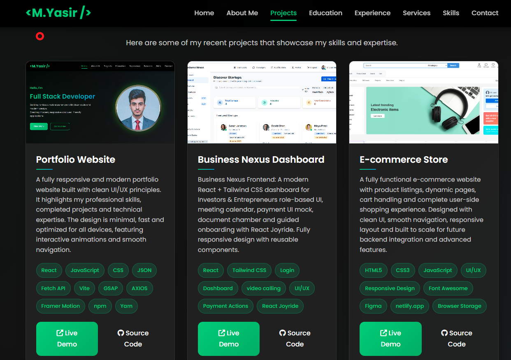
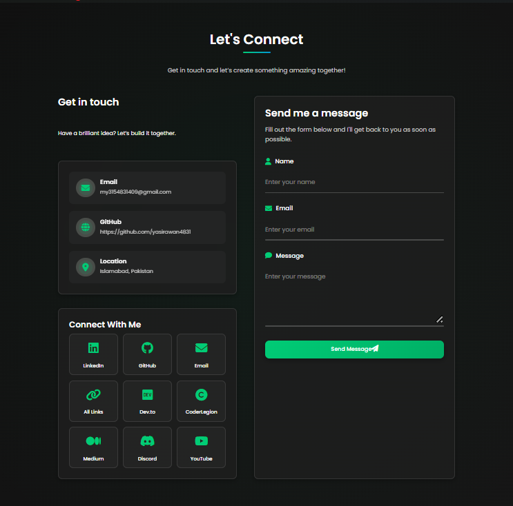

<div align="center">

#  Muhammad Yasir - Portfolio Website


[](https://yasirawan4831.github.io/)
[](https://github.com/yasirawan4831)
[](https://www.linkedin.com/in/yasirawan4831/)


</div>

A modern and responsive personal portfolio website built with **React.js**.  
This project is a React-based personal portfolio showcasing my web development skills.

---

### 🌐 Live Preview:
     https://yasirawaninfo.vercel.app/

---

##  Overview

A modern, responsive, and interactive personal portfolio website built with **React.js** and **Vite**.  
This portfolio showcases my skills, projects, education, professional experience and services in a clean and user-friendly interface.

### Key Highlights:
-  Modern UI/UX with smooth animations
-  Fully responsive design (Mobile, Tablet Desktop)
-  Custom cursor effects
-  Integrated contact form with EmailJS
-  Fast loading with Vite
-  Accessible and SEO optimized
-  Component-based architecture

---

##  Features

- ✅ **Responsive Design** - Works seamlessly on all devices
- ✅ **Dynamic Navigation** - Auto-highlighting active sections
- ✅ **Animated Sections** - Scroll-triggered animations
- ✅ **Project Showcase** - Interactive project cards with live demos
- ✅ **Skills Visualization** - Icon-based skill display
- ✅ **Contact Form** - Fully functional with email integration
- ✅ **Social Integration** - Links to GitHub, LinkedIn, Medium etc.
- ✅ **Custom Cursor** - Interactive cursor effects
- ✅ **Scroll to Top** - Smooth navigation button
- ✅ **SEO Optimized** - Meta tags, sitemap robots.txt

---

## Tech Stack

React.js, JavaScript (ES6+), HTML5, CSS3, vite, E-MailJS 

[]()
[]()
[]()
[]()
[]()
[]()
[]()
[]()
[]()
[]()
[]()
[]()
[]()
[]()
[]()
[]()
[]()
[]()
[]()
[]()
[]()
[]()
[]()
[]()
[]()
[]()


---

## 📁 Project Structure

```text
portfolio-core101/
├─ public/
│  ├─ assets/
│  │  ├─ all-photo/
│  │  │  ├─ about-pic.jpeg
│  │  │  ├─ aii-links.png
│  │  │  ├─ apni_pic.png
│  │  │  ├─ business-app.png
│  │  │  ├─ e-commerce.jpeg
│  │  │  ├─ final-year-project.png
│  │  │  ├─ portfolio-pic.png
│  │  │  ├─ product-list.png
│  │  │  ├─ python-project.png
│  │  │  ├─ quiz-app.png
│  │  │  ├─ singup-form.png
│  │  │  ├─ to-do.png
│  │  │  ├─ tourism-travel-website.jpeg
│  │  │  ├─ wp-site.jpeg
│  │  │  └─ yaris-ai-chatbot.jpeg
│  │  └─ project/
│  │     ├─ digitech-co-web-11.png
│  │     ├─ digitech-co-web-22.jpg
│  │     ├─ email-auto.jpg
│  │     ├─ grad-01.jpg
│  │     ├─ multi-tools-05.png
│  │     ├─ real-time-cl.png
│  │     ├─ resuma-ai03.png
│  │     ├─ rg-based-ai-a-04.png
│  │     ├─ rg-based-ai-a-044.png
│  │     ├─ star-dev-cop-10.jpg
│  │     ├─ task-manag-06.png
│  │     ├─ teyzix-core-inter-pro07b.jpg
│  │     └─ whatsaap-bot-12.png
│  ├─ icon.jpeg
│  ├─ robots.txt
│  └─ sitemap.xml
├─ src/
│  ├─ components/
│  │  ├─ About.jsx
│  │  ├─ Chatbot.jsx
│  │  ├─ Contact.jsx
│  │  ├─ Education.jsx
│  │  ├─ Experience.jsx
│  │  ├─ Footer.jsx
│  │  ├─ Home.jsx
│  │  ├─ Navbar.jsx
│  │  ├─ Projects.jsx
│  │  ├─ ScrollToTop.jsx
│  │  ├─ Services.jsx
│  │  └─ Skills.jsx
│  ├─ hooks/
│  │  ├─ useCustomCursor.js
│  │  ├─ useNavbar.js
│  │  └─ useScrollAnimation.js
│  ├─ styles/
│  │  ├─ About.css
│  │  ├─ App.css
│  │  ├─ Chatbot.css
│  │  ├─ Contact.css
│  │  ├─ Education.css
│  │  ├─ Experience.css
│  │  ├─ Footer.css
│  │  ├─ Home.css
│  │  ├─ Navbar.css
│  │  ├─ Projects.css
│  │  ├─ Services.css
│  │  └─ Skills.css
│  ├─ utils/
│  │  └─ constants.js
│  ├─ App.jsx
│  ├─ index.css
│  └─ main.jsx
├─ .gitignore
├─ image-1.png
├─ image-2.png
├─ image.png
├─ index.html
├─ LICENSE
├─ package-lock.json
├─ package.json
├─ README.md
└─ Update.md
  
```

---

##  Installation & Setup

### Prerequisites
- Node.js (v14 or higher)
- npm or yarn

### Steps

1. **Clone the repository**
```bash
git clone https://github.com/YasirAwan4831/muhammad-yasir-portfolio.git
```

2. **Navigate to project directory**
```bash
cd muhammad-yasir-portfolio
```

3. **Install dependencies**
```bash
npm install
```

4. **Start development server**
```bash
npm run dev
```

5. **Build for production**
```bash
npm run build
```

6. **Preview production build**
```bash
npm run preview
```

---

##  Components Overview

| Component | Description |
|-----------|-------------|
| `Navbar` | Responsive navigation with active link highlighting |
| `Home` | Hero section with animated profile image |
| `About` | Personal info, stats, and contact details |
| `Projects` | Interactive project cards with live demos |
| `Education` | Timeline of educational background |
| `Experience` | Professional work experience |
| `Services` | Services offered with detailed features |
| `Skills` | Technology stack visualization |
| `Contact` | Functional contact form with EmailJS |
| `Footer` | Copyright and social links |
| `ScrollToTop` | Smooth scroll-to-top button |

---

##  Custom Hooks

### `useCustomCursor`
Creates an interactive custom cursor that follows mouse movement.

### `useNavbar`
Handles navigation state, active section tracking, and smooth scrolling.

### `useScrollAnimation`
Triggers animations when elements enter the viewport using Intersection Observer API.

---

##  Contact Form & Email API

The portfolio features a **fully functional Contact Form** powered by **EmailJS API**.

### Features:
-  Real-time form validation
-  Success/Error notifications
-  Smooth animations
-  Spam protection
-  Mobile responsive

### How it works:
1. User fills out the form (Name, Email, Message)
2. Form validation checks input
4. User receives confirmation message


---

##  SEO Optimization

### Implemented SEO Features:
-  **Meta Tags** - Optimized title, description, keywords
-  **Open Graph** - Social media preview tags
-  **Twitter Cards** - Twitter-specific meta tags
-  **Schema.org** - Structured data (JSON-LD)
-  **Canonical URLs** - Prevent duplicate content
-  **Sitemap.xml** - Search engine site structure
-  **Robots.txt** - Search engine crawling instructions
-  **Semantic HTML** - Proper HTML5 elements
-  **Alt Tags** - Image descriptions

---

##  Performance

### Optimization Techniques:
-  Vite for fast build times
-  Code splitting & lazy loading
-  Image optimization
-  CSS minification
-  Font preloading
-  DNS prefetching

### Performance Metrics:
- Lighthouse Score: **95+**
- First Contentful Paint: **< 1.5s**
- Time to Interactive: **< 3s**

---

##  Screenshots

<details>
<summary>Click to view screenshots</summary>

### Home Section


### Projects Section


### Contact Section


</details>

---

##  Contributing

Contributions are welcome! Feel free to:
- Report bugs
- Suggest new features
- Submit pull requests

---

## 📄 License

© 2026 Muhammad Yasir. All Rights Reserved.
This portfolio is protected under proprietary license.
See [LICENSE](LICENSE) for details.

---

## 📬 Contact

<p align="center">

<a href="https://yasirawan4831.github.io/futuristic-links-dashboard/">

</a>

<a href="https://linkedin.com/in/yasirawan4831">

</a>

<a href="https://github.com/YasirAwan4831">

</a>

<a href="https://yasirawan4831.github.io/ApexcifyTechnologys-FrontendInternship/task-2/">

</a>

<a href="https://kaggle.com/yasirawan4831">

</a>

<a href="https://coderlegion.com/user/YasirAwan4831">

</a>

<a href="https://leetcode.com/u/YasirAwan4831">

</a>

<a href="https://stackoverflow.com/users/31822196/yasirawan4831">

</a>

<a href="https://forem.com/yasirawan4831">

</a>

<a href="https://hashnode.com/@YasirAwan4831">

</a>

<a href="https://medium.com/@YasirAwan4831">

</a>

<a href="https://substack.com/@yasirwaninfo">

</a>

<a href="https://www.youtube.com/@YasirTech-t1d">

</a>

<a href="https://x.com/YasirAwan4831">

</a>

<a href="https://instagram.com/yasirawan4831">

</a>

<a href="https://facebook.com/profile.php?id=61575935942197">

</a>

<a href="https://www.tiktok.com/@yasirawan4831?lang=en">

</a>

<a href="https://asani.pk/profile/yasirawan4831">

</a>

<a href="https://orcid.org/0009-0002-8711-6868">

</a>

<a href="https://developers.google.com/profile/u/yasirawaninfo">

</a>

<a href="https://discord.com/users/1298290889373913149">

</a>

<a href="mailto:my3154831409@gmail.com">

</a>

<a href="mailto:my3154831409@hotmail.com">

</a>

</p>

---

## 👨‍💻 Author

**Muhammad Yasir**


## 👨‍💻 Developer

<div align="center">

<br/>


<br/>

[](https://github.com/YasirAwan4831)
[](https://www.linkedin.com/in/yasirawan4831)
[](https://yasirawaninfo.vercel.app)
[](mailto:yasirawan4831@gmail.com)

<br/>


</div>

---

<div align="center">

### ⭐ Show Your Support

**If this project helped you or you found it interesting, please consider giving it a star!**

[](https://github.com/YasirAwan4831/text-analyzer)

<br/>

*Developed ❤️ by Muhammad Yasir — Full Stack Web Developer • AI & Automation Enthusiast*

</div>


